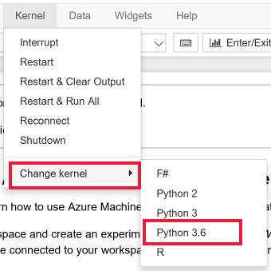

# Samples for NimbusML

[NimbusML](https://github.com/Microsoft/NimbusML) is a package of Python bindings for the [ML.NET](https://www.microsoft.com/net/learn/apps/machine-learning-and-ai/ml-dotnet) framework. ML.NET is a machine learning framework designed for .NET developers to build and use great machine learning models in their applications. It provides battle-tested state-of-the-art ML algorithms, transforms and components, aiming to make them useful for all developers. However, we also know that often people work in multiple programming languages or work in teams where people use multiple programming languages. 

In machine learning, Python has become very popular. We want to enable as many people to benefit from the ML.NET machine learning framework as possible and enable teams to work together, so we've created this project as Python bindings for ML.NET.

This is an open source project located at https://github.com/Microsoft/NimbusML. We'd love for you to try it out and/or contribute! For a full list of the samples/notebooks, please refer to our [documentation](https://docs.microsoft.com/en-us/nimbusml/overview).

## Try today with Azure Notebooks - free Jupyter based notebooks in the Azure cloud

1. 
[Import sample notebooks ](http://aka.ms/nimbusml/clone-aznotebooks) into Azure Notebooks.
1. Open one of the sample notebooks.
    
    **Make sure the Azure Notebook kernel is set to `Python 3.6`** when you open a notebook.  
    
    

# Contributing

This project welcomes contributions and suggestions.  Most contributions require you to agree to a
Contributor License Agreement (CLA) declaring that you have the right to, and actually do, grant us
the rights to use your contribution. For details, visit https://cla.microsoft.com.

When you submit a pull request, a CLA-bot will automatically determine whether you need to provide
a CLA and decorate the PR appropriately (e.g., label, comment). Simply follow the instructions
provided by the bot. You will only need to do this once across all repos using our CLA.

This project has adopted the [Microsoft Open Source Code of Conduct](https://opensource.microsoft.com/codeofconduct/).
For more information see the [Code of Conduct FAQ](https://opensource.microsoft.com/codeofconduct/faq/) or
contact [opencode@microsoft.com](mailto:opencode@microsoft.com) with any additional questions or comments.
